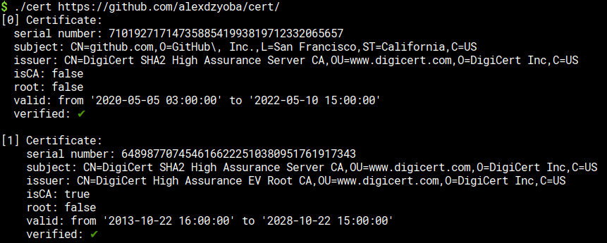

# cert

Handy certificate tool.

Its core purpose is to print certificate(s) in the nice way. If it sees multiple
certificates it will try to verify them as a chain.

## Examples

It can print from file

Or from URL:

## Installation

Download the file from the [latest release](https://github.com/alexdzyoba/cert/releases/latest).
